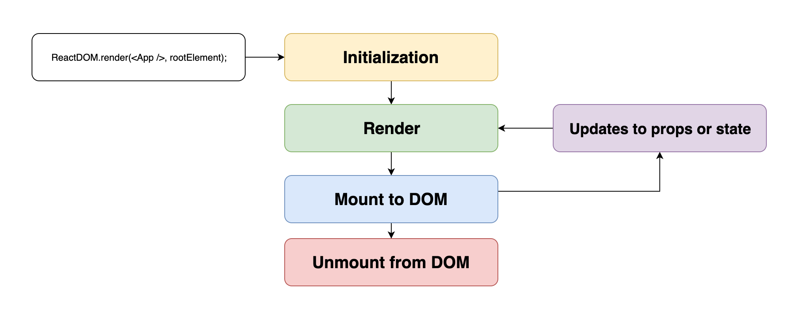

# Chapter 2: Props

---

## Props

- Passed in by parent
- Read only
- Only flow down the tree
- Any valid JavaScript

Notes: Props are variables passed to a component by its parent. Those variables are placed on a single object called `props` which stands for "properties". Props are passed from parent to child through the component tree.

---

```javascript
const Child = props => {
  return (
    <div>
      <h1>{props.name}</h1>
      <h2>{props.age}</h2>
    </div>
  );
};

const Parent = () => {
  const age = 15;

  return <Child name="Timmy" age={age} />;
};
```

Notes: Function components receive props as the first argument. Here we're passing in two props (name and age) to a function component. In JSX, props are passed in like html attributes. Hardcoded strings can be passed directly if they won't ever change. The brackets around the age look a bit funny but are for JSX to know we're evaluating a JavaScript value. Generally you'll pass in variables between brackets for most props. You might be wondering why we have age equal age. As of right now there isn't a shorthand syntax for passing in props that are the same name as a variable. There's open issues on React, Typescript, Babel that have been open for many years if you're interested in following the discussions.

---

```javascript
class Welcome extends React.Component {
  // Constructor takes props as an argument
  constructor(props) {}

  render() {
    // Every other method has access to this.props
    return <h1>hi {this.props.name}</h1>;
  }
}
```

Notes: Class components can access `this.props` in render and other lifecycle methods. Though `constructor` is called with props directly.

---

```javascript
// BAD
Button.propTypes = {
  fetchData: PropTypes.function
};

// BETTER
Button.propTypes = {
  onClick: PropTypes.function
};
```

Notes: Props are the API of of components. It's important to keep component APIs clean and useful. Props should be descriptive and to the level of abstraction that makes sense for that component. Props should not be dependent on the rest of the app, they should be self explanatory for the component so a developer doesn't have to dig through the source or rest of the app to understand.

PropTypes is one of a few ways to define and validate your component props. If you are using TypeScript or Flow, Props are still typed but will look a little different.

React exposes a proptypes package if you're not using TypeScript or Flow which will throw warnings during development for invalid props. We recommend at least some for of validation, be it proptypes, typescript, or flow.

---

```javascript
const Welcome = props => {
  props.name = "Bob";
  return <h1>Hello, {props.name}!</h1>;
};

// TypeError: Cannot assign to read only property 'name' of object '#<Object>'
```

Notes: One of the most important rules in React is that you cannot modify props. This is because props are `read-only` and breaking this rule will lead to the above error.

Props are read only for multiple reasons. Other components may be using that data in their render functions so mutating it in place would affect the component tree. Read only props protect from infinite loop renders and other circular tree dependencies.

React expects that props should always flow downward from parent to child and be immutable. These two guarantees allow for performance benefits and render safety. It also means your code is easier to reason about and maintain.

---

## Children

```javascript
const Title = props => {
  return (
    <h1>{props.children}</h1>
  );
};

const Parent = () => {
  return <Title>Hello</Title>;
};
```

Notes: props.children is a special prop name in react. Whatever is passed in between the open HTML brackets gets attached to props.children. It can be a string, a variable, or more react components. This enables easy composition of component hierarchies. You have to be careful with children... since it allows for potentially any components to be rendered within the structure. In most cases, this is exactly what you want. In other cases, you may want to document what are acceptable children for a component so as not to break layouts or create invalidly nested HTML.

---

## Other special props

- key
- ref

Notes: Key and ref are two other props that behave differently. For these props, they are reserved for react and are not available on the props object.

---

## key

```
<ul>
  {albumTitles.map(({ id, name }) => {
    return <li key={id}>{name}</li>;
  })}
</ul>
```

Notes: key is a unique identifier on list items. Not necessarily li tags like this example, but dynamically returned items from arrays. It's a special React construct for React to keep the virtual DOM and real DOM in sync and correctly update the real DOM as needed. Each key has to be unique and all dynamically rendered lists are required to have keys.

---

## ref

```javascript
<input
  type="checkbox"
  ref={(domElement) => { /* Handle DOM weirdness here*/ }}
/>
```

Notes: refs are an escape hatch for direct DOM manipulation. Ref as in reference to the dom node. There are two main APIs for creating refs. This is a callback ref, where we pass in a function to the special prop ref and that function is called with a reference to the DOM node of that input. Refs can be attached to HTML nodes or class components. On a class component, the element returned is not a DOM node but the mounted instance of that class. Refs can't be attached to a function component since there is no mounted instance to return.

---

## React.createRef

```javascript
class Counter extends React.Component {
  constructor() {
    super();
    this.inputRef = React.createRef();
  }

  render() {
    return (
      <form>
        <input ref={this.inputRef} />
      </form>
    );
  }
}
```

Notes: React also exposes a create ref method. We'll learn about lifecycle methods like constructor in the next chapter but this is another way to attach a ref to a class property. Refs are rarely used but may be necessesary for things like complex animations or focus manipulation. Usually large applications can avoid refs unless there are crazy requirements.

---

## Render Cycle



Notes: We've danced around the render cycle a little already so let's explain it more in depth. In both the browser and during server rendering you have a call to render the application for the first time. In the browser it looks like this ReactDOM.render call.

Before that first render can get painted to the browser, the entire component tree has to be initialized. React looks at that top level component App, which could be any component and follows it's children and ancestors down the tree until every node in the tree results in HTML. If we only had components that rendered more components, we'd be stuck in an infinite render loop. Along the way, React initializes every class component before calling it's render method. Functional components are just run as functions.

Once we have whole tree in the virtual DOM, react updates the DOM with the fewest and fastest number of calls. This is what we mean when we say a component has mounted, it's now available in the browser DOM which means our code or users can take actions on that DOM node. This is where refs come in, once mounted, we can operate directly on that DOM node via the ref.

After all components are mounted to the DOM, changes from either the user via DOM manipulation or application code can cause a new render cycle. This new render cycle is much faster and only updates the pieces of the tree affected. For instance, typing in an input should only rerender the component which output the input unless there's logic for handling input changes further up the component tree.

If a change results in a different tree structure with certain components removed, then a component is unmounted by React. In certain cases, you'll need to do clean up during this step to avoid memory leaks, mainly if you've set up intervals or timeouts.

---

## HTML Elements

```javascript
return (
  <div>
    <h1>Hello</h1>
  </div>
);
```

Notes: Every branch in the component tree must eventually lead to something like this. Browsers still only understand HTML despite ongoing best efforts. This may look like HTML but it's really a call to react.createElement, since we're writing JSX and not HTML. Because this is JSX, there are certain differences from HTML that we need to call out.

Sidenote, you can also use React to render SVGs since that's also valid HTML. All of this also applies to SVGs.

---

## HTML Props

- className
- htmlFor
- style
- onChange
- value
- checked
- selected
- dangerouslySetInnerHTML
- suppressHydrationWarning
- suppressContentEditableWarning

Notes: Most HTML attributes are 1:1 with their browser counterparts with a few important exceptions. className is probably the most obvious. When adding classes for CSS, we have to use className. This is because class is a reserved word in JavaScript.

htmlFor is the form label equivalent of for. For is a also reserved word in JavaScript so it's been changed.

style takes a JavaScript object instead of a string of CSS. The keys for this object are camelCased versions of their CSS counterparts. This is mainly used for dynamic styling based on some computation.

onChange behaves as expected with the caveat that this isn't a browser event due to differences in browser implementation. React normalizes these events and the callback receives a normalized event object.

value is how we handle form controls and is different from the HTML attribute value. Value is only ever updated by our code, so we need to make sure we're capturing user input in onChange and updating value accordingly.

checked is the checkbox equivalent of value and behaves similarly.

Selected is another form attribute for controlling dom state on options elements within a select element.

dangerouslySetInnerHTML is a fun one. It's another escape hatch that could open your site to cross site scripting attacks if you're not careful. If you absolutely need to inject some safe but unknown HTML into your app, this is React's way to do it declaratively.

suppressHydrationWarning - this is for server rendered code. React tries to verify that the server render and initial client render match. If they don't, you get a warning. Sometimes this mismatch is unavoidable so you can suppress the warning.

suppressContentEditableWarning - elements marked as content editable with throw this warning if you attempt to render them with children. These last three are very rarely used.

---

## Spread Operator

```javascript
const Welcome = props => {
  const { name, ...rest } = props;

  return (
    <div>
      <h1>Hello, {name}!</h1>
      <Content {...rest} />
    </div>
  );
};
```

Notes: Spread Operator - That sounds like a subway job but it's a standard ES6 feature that's been adapted into JSX. Here we're using it in two different ways. Spread syntax is the three dots before the rest, in the first case it's used as part of object destructuring. rest is a common name here but it's arbitrary on the second line. We're saying grab the property name from props and assign it to a local variable name. Then assign all other key value pairs to a new object called rest. In our JSX, we use the curly braces to jump into JavaScript and here the spread operator tells React to pass all key value pairs from rest to the Content component as props. There are other uses of the spread operator available in ES6 with arrays and objects.

Spread syntax is super useful for variable creation but we generally try to avoid situations like the above where it's unclear what is being passed down to Content. Now if we had proper typing for this component it's a different story. Ideally it would be clearly evident in this file what props are passed to Content.

---

## Render Props

```javascript
List = ({ items, renderItem }) => {
  return <ul>{items.map(renderItem)}</ul>;
};

App = () => {
  return (
    <div className="App">
      <List
        items={items}
        renderItem={({ id, name }) => {
          return <li key={id}>{name}</li>;
        }}
      />
    </div>
  );
};
```

Notes: A Render Prop is when a component exposes a prop for a function that renders a React element. It’s one way to encapsulate behavior and provide values to rendered components.

In this example, we use a `List` component that takes in the items to display and a function that determines how to render each item.

Render props came about to solve certain use cases where you need to subvert the flow of props from parent to child. The main use case is when you want to encapsulate dynamic UI or data changes in a component while still giving the consumer of that component control.

Generally speaking render props are worth trying to avoid. You need to understand them to consume third party libraries but most app developers have other ways to solve these scenarios in the context of an app. If you find yourself needing to encapsulate UI logic or dynamic data in a component, render props can be useful but most apps don't export complex components like those. Render props often lead to messy code and convoluted component trees that are hard to reason about.

---

# Exercises

1. Add classes and props to your elements for styling and more functionality
2. Wrap the h1 in a Link component
3. Update the Inbox component to take a list of emails as a prop
4. Implement the preview component and use it in the inbox list

---
