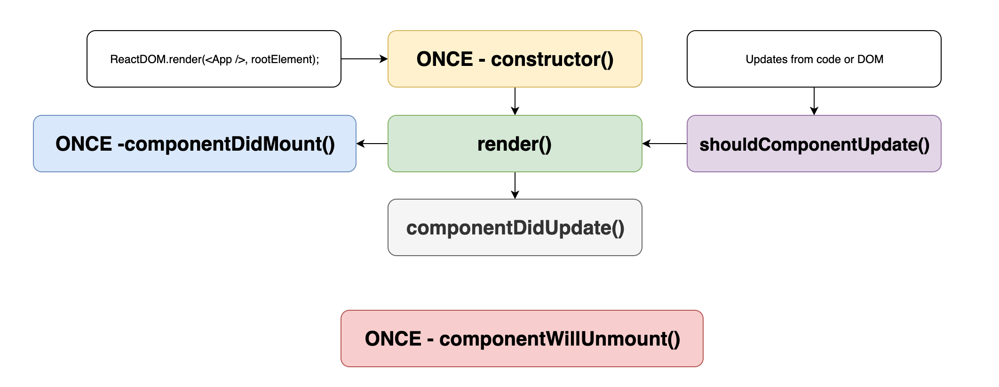

## Chapter 3: Component State

Notes: Applications are dynamic and need to change depending on user actions
and events. React uses `state` to as one way to handle updates to the DOM and refresh what the user sees.
State is just a class property that is initialized and managed by the component itself, like other class fields. State must be initialized in a class component. Although tomorrow you'll see how hooks circumvent this and allow us to handle state in a function component.

---

```javascript
class Counter extends React.Component {
  state = {
    numberOfClicks: 0
  };

  render = () => {
    return (
      <div>
        <h1>Clicks: {this.state.numberOfClicks}</h1>
      </div>
    );
  };
}
```

Notes: Great! We've set some state, it doesn't look very dynamic. This component will always show `Clicks: 0`.

---

## Setting State

```javascript
class Counter extends React.Component {
  state = {
    count: 0
  };

  handleClick = () => {
    this.setState({ count: this.state.count + 1 });
  };

  render() {
    return (
      <div>
        <p>You clicked {this.state.count} times</p>
        <button onClick={this.handleClick}>Click me</button>
      </div>
    );
  }
}
```

Notes: That's better, here we've got a click handler that calls setState which then triggers a re-render with the new state.

In React, state is updated by using this method called `setState`. Once `setState` is called, React is notified to update the components state internally and will call the render method again. If the output of render has changed, React will push those changes to the DOM.

---

## setState is asynchronous

```
setState(newState, () => {
  // DOM Updates finished
  // this.state is now updated
});
```

Notes: It's important to note that `setState` is asynchronous and React "batches"
updates under the hood.

There's a few reasons for this. The biggest is that batching is crucial to the performance of React. If every setState call was synchronous and triggered an immediate re-render, the UI could slow to a crawl with certain user interactions. Batching setState calls inherently leads to setState being asynchronous since React waits for all state updates to complete before updating the DOM.

---

```javascript
class Counter extends React.Component {
  state = {
    count: 0
  };

  handleClick = () => {
    this.setState({ count: this.state.count + 1 });
  };

  render() {
    return (
      <div>
        <p>You clicked {this.state.count} times</p>
        <button onClick={this.handleClick}>Click me</button>
      </div>
    );
  }
}
```

Notes: Now that we know setState is asynchronous, does anyone see a problem with this code?

What would happen if we click the button faster than the setState calls?

We'd potentially run the handleClick method with an outdated this.state value, incorrectly counting.

If you are not careful, this can lead to strange bugs where you
may receive outdated information.

---

```javascript
class Counter extends React.Component {
  state = {
    count: 0
  };

  handleClick = () => {
    this.setState(currentState => {
      {
        count: currentState.count + 1;
      }
    });
  };

  render() {
    return (
      <div>
        <p>You clicked {this.state.count} times</p>
        <button onClick={this.handleClick}>Click me</button>
      </div>
    );
  }
}
```

Notes: Here's a better approach.We can pass a function that allows React to call it with
the updated values of state and props.

You can lint for these cases to prevent weird bugs.

---

## More Key Points

- State is encapsulated
- State can be passed to children as props
- State only flows down
- Updates only affect derived UI

Notes: State is encapsulated. Parents and children have no idea if a component is stateful or not.

A component can pass its state down to a child as a prop.

State flows down in the React component tree.

Updating state only affects the UI that is derived from that state or child components that use it below in the tree.

This is important. In some cases local state is very performant for applications because you can limit the scope of the tree changes. We've talked about some reasons to avoid class components but there are also very valid reasons to use them like managing state across the component lifecycle.

---

```javascript
class NameInput extends React.Component {
  state = { name: "" };

  handleChange = event => {
    this.setState({ name: event.target.value });
  };

  render() {
    return (
      <input
        type="text"
        placeholder="First Name"
        value={this.state.name}
        onChange={this.handleChange}
      />
    );
  }
}
```

Notes: React enforces the concept of unidirectional data flow, where data only flows downwards. A good example of Reacts data flow is an input element. In this example, the `NameInput` component is the parent of the `input` element. `NameInput` holds the value of `name` in its `state`.It passes this value down to its child `input`. When a user types into the input field, the `handleChange` method is called and updates the state of the `NameInput` component. When the state is updated, React re-renders the component and its children.

What happens if we were to remove the `onChange` property on the input element and type in the input field? The value of the input field wouldn't update. That's because React is not listening to the input fields events and the input field can't tell React to update its state. It can only announce that its value has changed and let React choose how to respond to it. In this way, React is one-way binding.

---

## When to Avoid Component State

- When it's passed to numerous descendant components
- When it's a large or nested object

Notes: Local state can get unwieldy fast. More often than not, what starts out as local state ends up being state that should be share by multiple components AKA application state. With React's component tree, you'd have to move all this state into a common ancestor component in order to share state with sibling or components on other tree nodes.

Component state should be used sparingly when it's clear that the state will only relate to the current component or direct child components. For example, certain input components in component libraries may want to control their own validation state or tooltip state. Generally though most state in an application is bigger than a single component. For this we have a few options for application state stored outside of the component tree.

---

## Lifecycle Methods

Notes: We can use class component lifecycle methods when we need to enhance the behavior of a component. The following are a commonly used subset of lifecycle methods.

---

## constructor()

- Runs on first render of the component before any other methods
- First argument is props
- Must call super() first
- Only called once

Notes: We've already seen `constructor`. It is most commonly used to initialize component state as a function of props.

---

## render()

- The output of your component
- Called repeatedly
- Where the magic happens

Notes: `render` is a mandatory lifecycle method that returns elements that are drawn to the screen. It can return any valid React element type. If you forget to return a value from `render`, that is the same as returning `undefined`. React will warn you in the developer console.

---

## componentDidMount()

- Called once updates are in the DOM
- Called only once

Notes: `componentDidMount` is the sign that React mounted your component successfully. If you want a particular side-effect like an API request to be executed only once per component instance, or adding an interval, this is generally where it belongs. Direct DOM manipulations would also be placed here.

---

## componentWillUnmount()

- Called at the end of the component life cycle
- Called only once

Notes: `componentWillUnmount` is the inverse of `componentWillMount`. It indicates that React is preparing to remove your component from the tree/DOM. If you need to clean up any outstanding API requests or other side-effects, you should do that here.

In combination `componentWillMount`, these two methods are handy for setting and cleaning up timers, intervals, or event listeners safely.

---

## shouldComponentUpdate()

- Called before render
- useful for perf

Notes: We won't go into detail here but this is a useful method if you need to do some serious performance tuning. Allows you tell React if a component should render or not based on props and state.

---

## componentDidUpdate()

- Useful for weird DOM manipulations
- Not used very frequently

Notes: componentDidUpdate is useful if you need to handle weird DOM manipulations every time a change is pushed to the DOM. This one comes up very infrequently. There are other lifecycle methods, but we won't be covering them. They are escape hatches that are occasionally needed for strange UI or performance tweaks but can generally be left alone.

---

## Render Cycle


Notes: Here's our original flow of the render cycle. We initialize the components, render them, handle updates and rerenders and then unmount.

---

## Life Cycle Methods



Notes: Here's how the life cycle methods look in that flow

---

# Exercises

1. Implement the `Denied` component
2. Update the App component to hold state
3. Start an interval on component did mount
4. Clean up interval
5. Add class methods to the App component
6. Update the NavBar to correctly login and logout
7. Update the inbox component to show the denied and empty messages
8. Update the preview component to handle remove email
