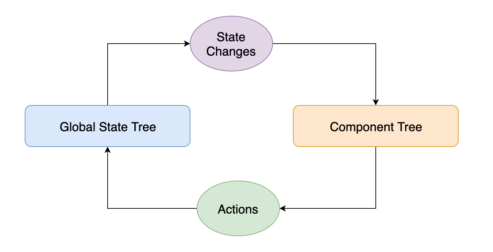

# Chapter 4: Context

---

## Prop Drilling

Notes: Often times data needs to be in multiple components at once. As an example, think of a users username being displayed in both the navigation bar and the profile page at the same time. Using Reacts local state, we would need to hold the state at the parent component of both the navbar and the profile page so that we can pass the username down to both children. This can often lead to passing props down multiple components, which we call "Prop Drilling".

While applications are small, prop drilling is not necessarily a bad thing. However, it can lead to unwieldy code that can be hard to maintain and difficult to refactor as an application grows.

---

## Context to the Rescue

Notes: Context lets you pass data and actions throughout your component tree without manually having to pass as props at every level.

This makes it easier to share a unified state and actions with many components that may not be direct descendants.

Prior to React’s new Context APIs many apps used Redux for centralized state management.

---

## Creating Context

```javascript
import React from “react”;

const AnimalContext = React.createContext();

const AnimalContext = React.createContext({
  name: “Milo”
});
```

Notes: React exposes the `createContext` api.

---

## Context Provider

```javascript
class WrappedApp extends React.Component {
  state = { name: “Milo” };

  handleChangeName = name => this.setState({ name });

  render() {
    return (
      <AnimalContext.Provider value={{
        name: this.state.name,
        changeName: this.handleChangeName
      }}>
        <App />
      </AnimalContext.Provider>
    );
  }
}
```

Notes: Provider Components wrap your App’s component subtree and are the source of truth for state. Additionally, Providers provide actions that can be used to update context state.

---

## Context Consumer

```javascript
import { AnimalContext } from “./contexts”;

const DogCard = () => {
  return (
    <AnimalContext.Consumer>
      {({ name }) => (<h1>{ name }</h1>)};
    </AnimalContext.Consumer>
  );
}
```

Notes: Consumer Components wrap any descendants in your App’s tree and let you use any state or actions you’ve provided as a value.

---

```javascript
const DogCard = () => {
  return (
    <AnimalContext.Consumer>
      {({ changeName }) => (
        <button onClick={() => changeName(“Beau”)}>
          Change Name
        </button>
      });
    </AnimalContext.Consumer>
  );
}
```

Notes: We can execute functions supplied by the Context Provider. In this case, we're updating the `name` value with `"Beau"`. Typically, changeName is called an action. That is, wire firing some action to be taken on the data store. It's up to the data store to handle that action, in this case our Animal Context Provider.

---

## All Together

```javascript
const AnimalContext = React.createContext({
  name: “Milo”
});

class WrappedApp extends React.Component {
  state = { name: “Milo” };

  handleChangeName = name => this.setState({ name });

  render() {
    return (
      <AnimalContext.Provider value={{
        name: this.state.name,
        changeName: this.handleChangeName
      }}>
        <App />
      </AnimalContext.Provider>
    );
  }
}

const DogCard = () => {
  return (
    <AnimalContext.Consumer>
      {({ name, changeName }) => (
        <h3>{name}</h3>
        <button onClick={() => changeName(“Beau”)}>
          Change Name
        </button>
      });
    </AnimalContext.Consumer>
  );
}
```

Notes: The context API is very lightweight and flexible. This is the simplest case to get up and running with context and passing data down the tree outside of props.

---

## Flux



Notes: When React was first released, there were no state management systems available. The React team recommended a pattern they called "Flux", which was just a fancy term for event emitters. The way flux works is - you have a global state outside of your component tree. Components use that state in a read only way, much like props. The state is updated by "Actions", a component can fire an action, and then it's up to the flux state tree to handle that action an emit an event once it's completed.

Redux (and many other libraries) took that initial seed of an idea and expanded on it to form more opinionated state management libraries.

Why is this important to context? This context API is a result of condensing the most commonly used cases across state management librarires into a simple to use API. It's light weight and flexible with very minimal opinions. It's similar to Redux in some ways and very different in it's lack of boilerplate and rigid structure. These days, a lot of our projects end up relying solely on context instead of redux or another state management library.

---

## Action Patterns

Notes: There are two main patterns that most apps follow. The "event sourcing" model or the "command pattern". These terms are most common when discussing redux as a data store but both of those terms exist outside of redux. They describe data passing architectures.

---

## Event Sourcing

Pros:

- Easy to get started, just setup a component to fire an event
- Easy to reason about where the event originated

Cons:

- Hard to refactor if UI changes
- Encourages state structure that doesn't match data
- Leads to spaghetti actions

Notes: With this structure, actions are coupled to the components that create them. In this pattern, action types are past tense and describe the view event. E.g. `{ type: 'FILTER_BUTTON_CLICKED'...}`.

---

## Command Pattern

Pros:

- Easy to model actions and data around the data domain (This is big)
- UI can change without affecting actions or reducers

Cons:

- Requires upfront modeling of data
- Obscures originator of the event

Notes: The command pattern takes the opposite approach from event sourcing and couples the actions to data. Types in this pattern are commands to be acted on the data in the form of `VERB_SUBJECT` e.g `FILTER_MESSAGES, GET_USERS`.

---

## Sample Context

```javascript

const AuthContext = React.createContext({});

export class AuthProvider extends React.Component
  state = {
    currentUser: null,
    isAdmin: false,
  }

  componentDidMount() {
    getCurrentUser()
      .then(currentUser => this.setState({ currentUser }));
  }

  updateIsAdmin = (isAdmin) => {
    this.setState({ isAdmin });
  }


  render() {
    const value = {
      ...this.state,
      updateIsAdmin: this.updateIsAdmin,
    };

    return <ContextProvider value={value} {...this.props} />;
  }
};

export const connectAuth = (Component, mapStateToProps = props => props) => {
  <AuthContext.Consumer>
    {context => {
      if (context === undefined) {
        throw new Error('connectAuth must be used within a AuthProvider')
      }

      return <Component {...mapStateToProps(context)} />
    }}
  </AuthContext.Consumer>
};
```

Notes: This is a lot to take in. The general thing to note here is that we're wrapping context in some extra functionality before exposing it with a slightly different API. This was a common pattern before hooks and you'll see how hooks can clean this up a bit.

First, we're exposing a custom provider component with some added functionality. It's simply rendering a standard context provider with state that we're driving from component state. We can add any custom actions to our context by attaching them to this class.

Second, we have a connect function instead of a context consumer. This is a personal preference. With hooks, this is generally not needed. This pattern is useful because it keeps consuming components clean and easy to test since their only interaction with context is now through props.

---

## Using the custom context

```javascript
// Somewhere near the top of the app
<AuthProvider>
  <App />
</AuthProvider>

// In a consuming component AKA container
const Login = ({ currentUser }) => {
  if (!currentUser) {
    return <LoginForm />
  }

  return <LogoutButton />
}

export default connectAuth(Login, (authState) => {{
  currentUser: authState.currentUser
}})
```

Notes: We render our AuthProvider somewhere near the top in the component tree. That way all our components have access to it. For our login container (container since it's connected to global state) we use our connect function to pass in only the state we need. In this case we care about currentUser. If we don't have a current user in our state, we'll show the login form, otherwise we'll show a logout button.

When our auth context updates, this component will simply rerender with new props.

The second argument to connectAuth isn't strictly necessary here, since we're passing currentUser, but it simplifies props being sent to login. It makes testing login simpler since we know it will only take one prop. Often, we'll export both the connected component as the default, and the unconnected component for easy testing.

---

## Actions

```javascript
const AdminForm = ({ onChangeAdmin, checked }) => {
  return <AdminCheckbox onChange={onChangeAdmin} checked={checked} />
}

export default connectAuth(AdminForm, (authState) => {{
  onChangeAdmin: authState.updateIsAdmin,
  checked: authState.isAdmin
}})
```

Notes: Say we wanted to perfom some action on our data. In our case we had a context that could update whether a user was an admin. Here we pass in that action to our component which renames parts of our state and actions and passes them down to child components. We can pass actions just as props, which makes this AdminForm component simple and easy to test.

---

## Complex Patterns

```javascript
const UserDetail = ({ getUserById, userId }) => {
  const currentUser = getUserById(userId);

  return <h1>{currentUser.name} - {currentUser.email}</h1>;
}

export default connectUsers(UserDetail, (userState) => {{
  getUserById: userState.getUserById
}})

// When using UserDetail elsewhere
<UserDetail userId={userId} />
```

Notes: This is a contrived example but it's a useful pattern. Say we have a user list stored on context. We want a way to pick out specific users for our UserDetail Component. In this case, UserDetail will accept an action that's more of a getter. UserDetail will call getUserById with the correct userId from it's props where it's consumed. There are many ways to structure this. You could also set it up so the connect function that maps state to props handles this case so UserDetail component stays simpler

---

## Exercises

1. Implement a context component that exports a Provider, Consumer and Context.

2. Wrap the App in the newly created AppProvider.

3. Move the polling functionality from the Inbox component to the context
component.

4. Update the Inbox component to use the new context.

5. Update the NavBar component to use the new context.

6. Update the Preview component to use the new context.
